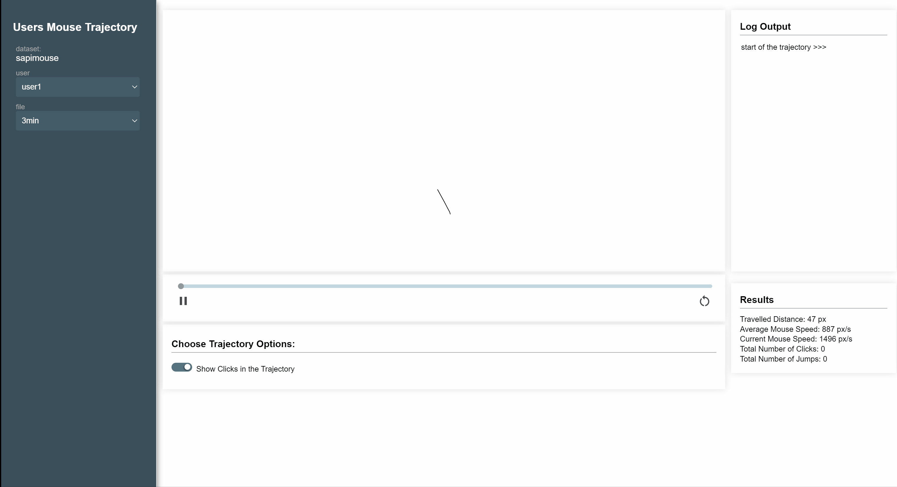

# Animation of (Mouse) Trajectories (SapiMouse edition)

This tool visualizes the [SapiMouse](https://www.ms.sapientia.ro/~manyi/sapimouse/sapimouse.html) dataset
for better investigation.


----
## setup

### set up a local server

P5.js requires a local server.  I can recommend node.js `http-server`. But every other is fine. 

1) Download and Install [node.js](https://nodejs.org/en/download/) 

2) Open a terminal or command prompt (on Windows you might need to open the command prompt as admin)

3) In the terminal type:
```
npm install -g http-server
```

From then on just cd to the folder that has the files you want to serve and type

```
http-server
```

Then point your browser at `http://localhost:8081/`


----

## Use your own data

You can record your own data using publicly available [collection application](https://mousedynamicsdatalogger.netlify.app).
- Copy your data as `.csv` files into the [data](data/[yourname]/) folder
- Currently, the tool needs a file with a list of the file names, to make a selection possible. Upload a `.txt` file with all files name in [assets](assets/).
- Change lines 2 and 3 in [sketch.js](sketch.js).
- Change the strings in the `preload` function in [sketch.js](sketch.js) accordingly.
- The given demo sets the canvas size according to the maximum x/y coordinates. You might want to change this.

You are able to inspect the data more precisely using the following tools:

- A Pause/Play button to control the trajectory
- A slider below the canvas allowing you to skip/rewatch parts of the trajectory
- The output shows the last actions within the programme
- red/green circles indicate the user's mouse clicks and if they were positioned in the check boxes.
- bold line indicated dragging actions of the mouse.


### About the file selects

- the data file names had to be changes to be able to be selected by the dropdown options.
- If you record you own data via the data collection application, make sure that you also change the name accordingly.

---

## Todo's
 - rework algorithm to control the slider (it gets quite slow on bigger files).
 - mark different tasks in separate colors. 
 - calculate pauses and display them in the log.